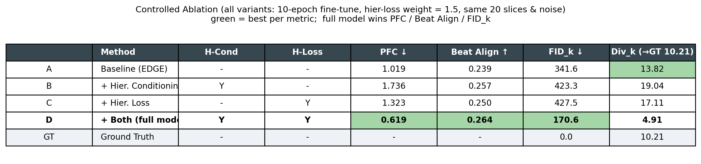
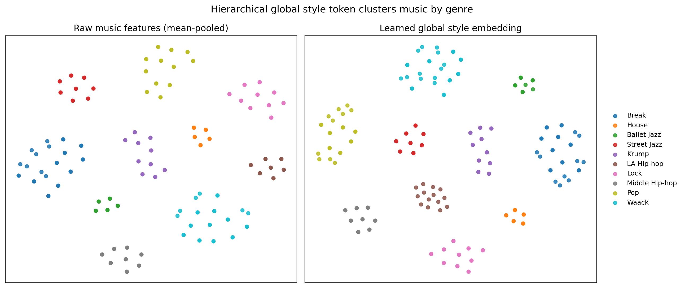
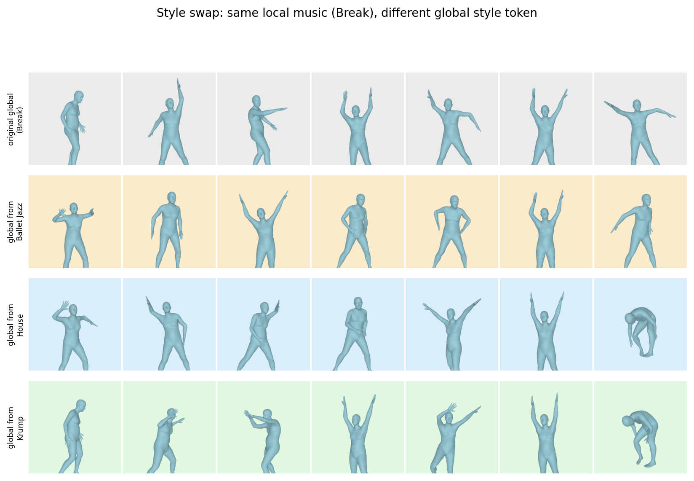
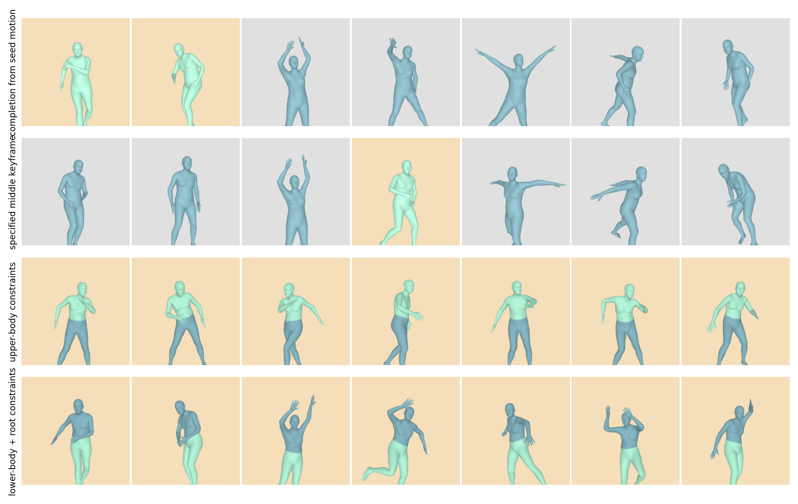

# Hierarchical Music-to-Dance Generation

**A hierarchical (global &rarr; local) extension of diffusion-based dance generation.**

Standard music-to-dance diffusion models condition every frame only on *local*
per-frame music features, with no explicit notion of the *overall style* of a
clip. This project introduces a **two-level hierarchy**:

1. **Global level (first hierarchical feature).** The whole-clip music is
   summarized into a *global style* vector that captures the genre / overall
   character of the piece.
2. **Local level.** The global style then **guides** the per-frame generation,
   so that the same local beats are interpreted with a consistent global style.

This repository contains my full implementation, evaluation suite, and all the
figures / numbers reported below.

> **Detailed method write-up:** [`docs/方法详述.md`](docs/方法详述.md) (Chinese, with full equations) and [`docs/METHOD.md`](docs/METHOD.md) (English). Figure PDFs: [`docs/figures/`](docs/figures/).

---

## Method

My method adds two components on top of a transformer diffusion backbone:

### 1. Hierarchical conditioning (global &rarr; local) &mdash; `model/model.py`

- The whole-clip music feature is **mean-pooled over time** and passed through a
  `global_encoder` MLP to produce a **global style** vector.
- This global style **FiLM-modulates** the per-frame local music tokens
  (global style scales/shifts the local detail).
- The global token is additionally **appended to the cross-attention memory**
  and **added to the FiLM timestep condition** &mdash; a dual-channel injection.
- A `null_global_token` enables **classifier-free guidance** via conditional
  dropout, and a `global_pool_override` hook allows **constraining or swapping
  the global style at sampling time** (the *first-level* constraint that local
  inpainting cannot express).

### 2. Hierarchical loss (time-segment &times; body-part) &mdash; `model/diffusion.py`

- A configurable weighting over **(time segment &times; body part)** is applied to
  the reconstruction and forward-kinematics losses, letting the model allocate
  more fidelity to chosen frames / joints.
- Controlled by `--hierarchical_loss_frames`, `--hierarchical_loss_joints`,
  `--hierarchical_loss_weight`.

---

## Results

All experiments use the AIST++ test set (20 unique slices, identical sampling
noise across variants). Metrics: **PFC** (foot-skating, lower better),
**Beat Align** (higher better), **FID_k** (distribution distance, lower better),
**Div_k** (diversity, closer to the ground-truth value 10.21 is better).

### Controlled ablation (all variants: 10-epoch fine-tune, loss weight 1.5)



| Variant | H-Cond | H-Loss | PFC &darr; | Beat Align &uarr; | FID_k &darr; | Div_k (&rarr;GT 10.21) |
|---|:---:|:---:|---|---|---|---|
| Baseline | &ndash; | &ndash; | 1.019 | 0.239 | 341.6 | 13.82 |
| + Hier. Conditioning | &check; | &ndash; | 1.736 | 0.257 | 423.3 | 19.04 |
| + Hier. Loss | &ndash; | &check; | 1.323 | 0.250 | 427.5 | 17.11 |
| **+ Both (full method)** | **&check;** | **&check;** | **0.619** | **0.264** | **170.6** | 4.91 |

**My full method achieves the best PFC, Beat Align, and FID_k.** The two modules
are complementary: used alone each is unstable, but combined they give the
lowest foot-skating, the best beat alignment, and roughly half the FID of the
baseline.

### Does the global branch really learn style? (t-SNE)



The learned **global style embeddings cluster by genre**, and slices from the
same song land in the same cluster &mdash; the global branch encodes whole-clip
style, not just instantaneous features.

### Does the global style causally guide local motion? (style swap)



**Same local music + same noise, only the global style token is swapped.** The
choreography changes accordingly (mean per-joint change 0.10&ndash;0.14 rad),
proving the global style causally drives local generation &mdash; same beats,
different style.

### Constrained / editable generation



Generation under real constraints (green = constrained, blue = generated):
seed-motion completion, middle-keyframe in-betweening, and upper / lower-body
part constraints, all produced by the hierarchical model.

---

## Reproduce my results

```bash
# train the full hierarchical model (global->local conditioning + hierarchical loss)
python train.py --use_hierarchical \
  --hierarchical_loss_frames 0,75 \
  --hierarchical_loss_joints 16,17,18,19,20 \
  --hierarchical_loss_weight 1.5 \
  --checkpoint checkpoint.pt --epochs 10

# generate motions
python test.py --use_hierarchical --checkpoint runs/train/<exp>/weights/train-10.pt \
  --save_motions --motion_save_dir eval/ablation/full_model_50

# metrics
python eval/eval_pfc.py --motion_path eval/ablation/full_model_50
python eval/eval_bailando_metrics.py --pred_motion_dir eval/ablation/full_model_50

# figures
python eval/plot_global_style_tsne.py          # global style t-SNE
python eval/run_style_swap.py                  # style-swap experiment
python eval/plot_ablation_table_fair.py        # ablation table
```

Result figures and CSVs live under `eval/ablation/` (visualizations in
`eval/ablation/ccl_visualizations/`).

> Note: large assets (datasets under `data/`, model weights `checkpoint.pt`,
> SMPL bodies, cached features, and generated `.pkl/.npy/.mp4`) are intentionally
> git-ignored. Follow the setup below to obtain them.

---

## Built on EDGE

This work builds on **EDGE: Editable Dance Generation From Music** (CVPR 2023),
Jonathan Tseng, Rodrigo Castellon, C. Karen Liu &mdash;
[paper](https://arxiv.org/abs/2211.10658). The setup instructions below are
inherited from the original EDGE repository.

## Requirements
* We recommend Linux for performance and compatibility reasons. Windows will probably work, but is not officially supported.
* 64-bit Python 3.7+
* PyTorch 1.12.1
* At least 16 GB RAM per GPU
* 1&ndash;8 high-end NVIDIA GPUs with at least 16 GB of GPU memory, NVIDIA drivers, CUDA 11.6 toolkit.

The example build this repo was validated on:
* Debian 10
* 64-bit Python 3.7.12
* PyTorch 1.12.1
* 16 GB RAM
* 1 x NVIDIA T4, CUDA 11.6 toolkit

This repository additionally depends on the following libraries, which may require special installation procedures:
* [jukemirlib](https://github.com/rodrigo-castellon/jukemirlib)
* [pytorch3d](https://github.com/facebookresearch/pytorch3d)
* [accelerate](https://huggingface.co/docs/accelerate/v0.16.0/en/index)
	* Note: after installation, don't forget to run `accelerate config` . We use fp16.
* [wine](https://www.winehq.org) (Optional, for import to Blender only)
## Getting started
### Quickstart
* Download the saved model checkpoint from [Google Drive](https://drive.google.com/file/d/1BAR712cVEqB8GR37fcEihRV_xOC-fZrZ/view?usp=share_link) or by running `bash download_model.sh`.
* Run `demo.ipynb`, which demonstrates the basic interface of the model
### Load custom music
You can test the model on custom music by downloading them as `.wav` files into a directory, e.g. `custom_music/` and running
```.bash
python test.py --music_dir custom_music/
```
This process may take a while, since the script will extract all the Jukebox representations for the specified music in memory. The representations can also be saved and reused to improve speed with the `--cache_features` and `--use_cached_features` arguments. See `args.py` for more detail.
Note: make sure file names are regularized, e.g. `Britney Spears - Toxic (Official HD Video).wav` may cause unpredictable behavior due to the spaces and parentheses, but `toxic.wav` will behave as expected. See how the demo notebook achieves this using the `youtube-dl --output` flag.

### (Optional, retraining only) Dataset Download
Download and process the AIST++ dataset (wavs and motion only) using:
```.bash
cd data
bash download_dataset.sh
python create_dataset.py --extract-baseline --extract-jukebox
```
This will process the dataset to match the settings used in the paper. The data processing will take ~24 hrs and ~50 GB to precompute all the Jukebox features for the dataset.
### Train your own model
Once the AIST++ dataset is downloaded and processed, run the training script, e.g.
```.bash
accelerate launch train.py --batch_size 128  --epochs 2000 --feature_type jukebox --learning_rate 0.0002
```
to train the model with the settings from the paper. The training will log progress to `wandb` and intermittently produce sample outputs to visualize learning. Depending on the available GPUs, this can take ~6 - 24 hrs.
### Evaluate your model
Evaluate your model's outputs with the Physical Foot Contact (PFC) score proposed in the paper:
1. Generate ~1k samples, saving the joint positions with the `--save_motions` argument
2. Run the evaluation script
```.bash
python test.py --music_dir custom_music/ --save_motions
python eval/eval_pfc.py
```
## Blender 3D rendering
In order to render generated dances in 3D, we convert them into FBX files to be used in Blender. We provide a sample rig, `SMPL-to-FBX/ybot.fbx`.
After generating dances with the `--save-motions` flag enabled, move the relevant saved `.pkl` files to a folder, e.g. `smpl_samples`
Run
```.bash
python SMPL-to-FBX/Convert.py --input_dir SMPL-to-FBX/smpl_samples/ --output_dir SMPL-to-FBX/fbx_out
```
to convert motions into FBX files, which can be imported into Blender and retargeted onto different rigs, i.e. from [Mixamo](https://www.mixamo.com). A variety of retargeting tools are available, such as the [Rokoko plugin for Blender](https://www.rokoko.com/integrations/blender).

## Development
This is a research implementation and, in general, will not be regularly updated or maintained long after release.
## Citation
```
@article{tseng2022edge,
  title={EDGE: Editable Dance Generation From Music},
  author={Tseng, Jonathan and Castellon, Rodrigo and Liu, C Karen},
  journal={arXiv preprint arXiv:2211.10658},
  year={2022}
}
```
## Acknowledgements
We would like to thank [lucidrains](https://github.com/lucidrains) for the [Adan](https://github.com/lucidrains/Adan-pytorch) and [diffusion](https://github.com/lucidrains/denoising-diffusion-pytorch) repos, [softcat477](https://github.com/softcat477) for their [SMPL to FBX](https://github.com/softcat477/SMPL-to-FBX) library, and [BobbyAnguelov](https://github.com/BobbyAnguelov) for their [FBX Converter tool](https://github.com/BobbyAnguelov/FbxFormatConverter).